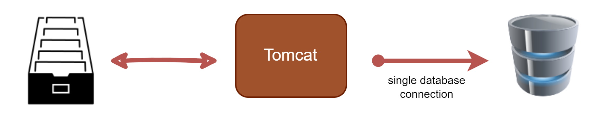

# web-student-tracker


**Student DB Utility**
+ Responsible for interfacing with the database using JDBC code
+ This is a common design pattern: **Data Accessor Object (DAO**


**Create a Database Application**   

_Class Project_
+ Fill working JSP and Servlet application that connects to a database
  

**Road Map**
+ Set up Database Dev Environment
+ List Student
+ Add a new Student
+ Update a Student
+ Delete a Student


## Setup Tomcat Database Connection Pool

**Database Connection in Web Apps**

+ You may think you need a single database connection...
  + Will **mot scale** for multiple web users  


This will not scale for multiple users.  
For example: you have a large number of users, and they all want to make use of one telephone. So, your office only has one telephone and you have 40 or 50 people and they need to make use of the telephone to make a phone call. So, this wouldn't work out. You'll have along queue and people will wait to actually use the telephone. So, we need to have a solution for this. So, the best practice in the industry is to make sure of database connection pools.

**Database Connection Pools**
+ Best practice is to use **database connection pools**
  + Allows your app to scale and handle multiple users quickly

  + This will allow your app to scale and handle multiple users quickly.

**Database Connection in Tomcat**
1. Download JDBC Driver JAR file
    + Place the JAR file in your app's **WEB-INF/lib**
2. Define connection pool in **META-INF/context.xml**  

**File: WebContent/META-INF/context.xml**
```XML
 <Context>

    <Resource name="jdbc/student_tracker"
              auth="Container" type="javax.sql.DataSource"
              maxActive="20" maxIdle="5" maxWait="10000"
              username="webstudent" password="webstudent"
              driverClassName="org.postgresql.Driver"
              url="jdbc:postgresql://localhost:3306/web_student_tracker"/>

</Context>
```
+ This is a Tomcat specific file that basically tells Tomcat how to connect to database and how to configure connection pool
  + Such as how many connections to create up front, the minimum numbers of connections, etc...
+ `name="jdbc/student_tracker"` is the alias that is used in application to look up this connection pool.
+ `auth="Container"` means authenticate  auth="Container" means Tomcat server will handle the authentication
+ `type="javax.sql.DataSource"` The actual name of java interface that is use for communication with pool.
  + In the java world, DataSource is generic term for you connection pool.
+ ` maxActive="20" maxIdle="5" maxWait="10000"` are Size configuration.
  + `maxActive="20"` means we're going to have 20 connections in our pool.
  + `maxIdle="5"` means  if there are no users in our system, at least 5 connections are available.
  + `maxWait="10000"` is time in milliSeconds as for as how long someone can wait before they get a connection.

3. Get connection pool reference in Java code
    + Leverage _resource injection_ with the Servlets
    + This means that Tomcat will AUTOMAGICALLY
      + Set the connection pool / datasource on your servlet


**Configuring jdbc-pool for high-concurrency**

- <https://my.oschina.net/shipley/blog/519449>

**--**

**Real-World Tips and Tricks to Tune Apache Tomcat for High Performance**

- <https://www.eginnovations.com/blog/tomcat-performance-tuning/>

**--**

**Optimal number of connections in connection pool**

- <http://stackoverflow.com/questions/1208077/optimal-number-of-connections-in-connection-pool>

